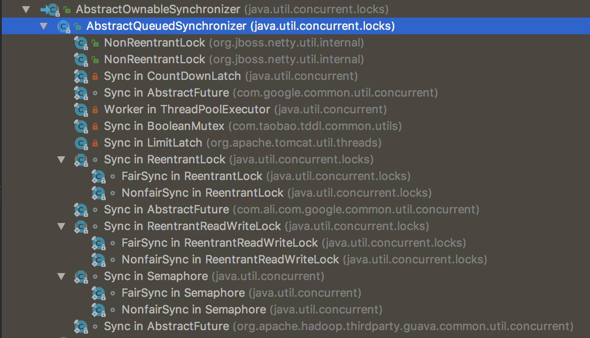

## JUC中的地位

AQS(AbstractQueuedSynchronizer)是 java.util.concurrent的基础。AQS的主要使用方式是继承。

J.U.C中封装良好的同步工具类ReentrantLock、ReentrantReadWriteLock、FutureTask、Semaphore、CountDownLatch等虽然各自都有不同特征，但是每个类内部都包含一个如下的内部类定义继承自AQS。

这些内部类继承AQS并实现它的抽象方法来管理同步状态

``` 
abstract static class Sync extends AbstractQueuedSynchronizer
```

以下是类的继承体系



继承AQS的类都需要实现以下5个类，若直接使用则会抛错
```
    //独占式获取同步状态，实现该方法需要查询当前状态并判断同步状态是否符合预期，然后再进行CAS进行设置同步状态
    protected boolean tryAcquire(int arg) {
        throw new UnsupportedOperationException();
    }

    //独占式释放同步状态，等待获取同步状态的线程有机会获取同步状态
    protected boolean tryRelease(int arg) {
        throw new UnsupportedOperationException();
    }

    protected int tryAcquireShared(int arg) {
        throw new UnsupportedOperationException();
    }

    protected boolean tryReleaseShared(int arg) {
        throw new UnsupportedOperationException();
    }
    
    protected boolean isHeldExclusively() {
        throw new UnsupportedOperationException();
    }
```

在上述的同步工具类中，在重写上述方法时，会使用AQS提供的三个最基本的状态操作方法。
- getState：获取当前同步状态
- setState：设置当前同步状态
- compareAndSetState：使用CAS设置当前状态，该方法能够保证状态设置的原子性

另外AQS中的关键的节点Node中，有以下几个属性，其中volatile非常重要。
```$xslt
static final class Node {
        volatile int waitStatus;

        volatile Node prev;
        
        volatile Node next;
        
        volatile Thread thread;
        
        Node nextWaiter;
    }
```

## AQS的使用

## AQS的原理

它使用了一个int成员变量来表示同步状态，它提供了一个基于FIFO队列，可以用于构建锁或者其他相关同步装置的基础框架。


通过修改状态来实现锁的获取

http://www.cnblogs.com/leesf456/p/5350186.html
http://brokendreams.iteye.com/blog/2250372
http://blog.csdn.net/yuenkin/article/details/50867530
http://ifeve.com/introduce-abstractqueuedsynchronizer/

Lock、ReentrantLock和AbstractQueuedSynchronizer的源码要点分析整理
Condition及其队列操作是基于AQS实现的
http://www.molotang.com/articles/480.html

AbstractQueuedSynchronizer在工具类Semaphore、CountDownLatch、ReentrantLock中的应用和CyclicBarrier
http://www.molotang.com/articles/487.html


### 公平锁原理

先看Lock方法：
lock方法最终调用FairSync重写的tryAcquire方法

```
        protected final boolean tryAcquire(int acquires) {
            //获取当前线程和状态值
            final Thread current = Thread.currentThread();
            int c = getState();
           //状态为0说明该锁未被任何线程持有
            if (c == 0) {
             //为了实现公平，首先看队列里面是否有节点，有的话再看节点所属线程是不是当前线程，是的话hasQueuedPredecessors返回false,然后使用原子操作compareAndSetState保证一个线程更新状态为1，设置排他锁归属与当前线程。其他线程通过cass则返回false.
                if (!hasQueuedPredecessors() &&
                    compareAndSetState(0, acquires)) {
                    setExclusiveOwnerThread(current);
                    return true;
                }
            }
//状态不为0说明该锁已经被线程持有，则看是否是当前线程持有，是则重入锁次数+1.
            else if (current == getExclusiveOwnerThread()) {
                int nextc = c + acquires;
                if (nextc < 0)
                    throw new Error("Maximum lock count exceeded");

                setState(nextc);
                return true;
            }
            return false;
        }
    }

```

公平性保证代码：

```
    public final boolean hasQueuedPredecessors() {

        Node t = tail; // Read fields in reverse initialization order
        Node h = head;
        Node s;
        return h != t &&
            ((s = h.next) == null || s.thread != Thread.currentThread());
    }

```

再看看unLock方法，最终调用了Sync的tryRelease方法：

```
        protected final boolean tryRelease(int releases) {
           //如果不是锁持有者调用UNlock则抛出异常。
            int c = getState() - releases;
            if (Thread.currentThread() != getExclusiveOwnerThread())
                throw new IllegalMonitorStateException();
            boolean free = false;
           //如果当前可重入次数为0，则清空锁持有线程
            if (c == 0) {
                free = true;
                setExclusiveOwnerThread(null);
            }
            //设置可重入次数为原始值-1
            setState(c);
            return free;
        }
```

### 非公平锁原理

```
 final void lock() {

           //如果当前锁空闲0，则设置状态为1，并且设置当前线程为锁持有者
            if (compareAndSetState(0, 1))
                setExclusiveOwnerThread(Thread.currentThread());
            else
                acquire(1);//调用重写的tryAcquire方法-》nonfairTryAcquire方法
        }

 final boolean nonfairTryAcquire(int acquires) {
            final Thread current = Thread.currentThread();
            int c = getState();
            if (c == 0) {//状态为0说明没有线程持有该锁
                if (compareAndSetState(0, acquires)) {//cass原子性操作，保证只有一个线程可以设置状态
                    setExclusiveOwnerThread(current);//设置锁所有者
                    return true;
                }
            }//如果当前线程是锁持有者则可重入锁计数+1
            else if (current == getExclusiveOwnerThread()) {
                int nextc = c + acquires;
                if (nextc < 0) // overflow
                    throw new Error("Maximum lock count exceeded");
                setState(nextc);
                return true;
            }
            return false;
        }
```

可知公平与非公平都是先执行tryAcquire尝试获取锁，如果成功则直接获取锁，如果不成功则把当前线程放入队列。对于放入队列里面的第一个线程A在unpark后会进行自旋调用tryAcquire尝试获取锁，假如这时候有一个线程B执行了lock操作，那么也会调用tryAcquire方法尝试获取锁，但是线程B并不在队列里面，但是线程B有可能比线程A优先获取到锁，也就是说虽然线程A先请求的锁，但是却有可能没有B先获取锁，这是非公平锁实现。而公平锁要保证线程A要比线程B先获取锁。所以公平锁相比非公平锁在tryAcquire里面添加了hasQueuedPredecessors方法用来保证公平性。