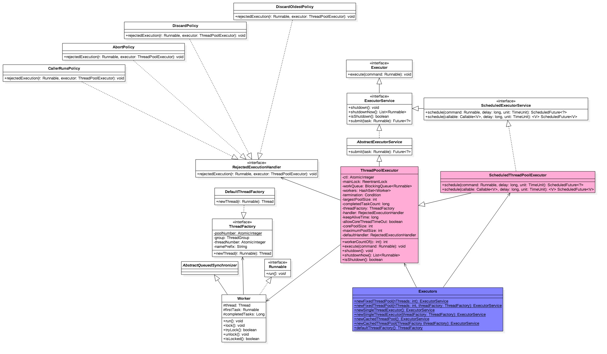

# Java线程池-原理和源码解析

## 前言

我们的工作中遇到很多异步任务的场景，需要处理很多任务，一般情况下使用线程池，可以提高程序的性能，合理使用线程池可以带来3个好处

- 降低资源消耗。
- 提高响应速度。
- 提高线程的可管理性。

前两个好处都是因为线程池中的线程是可复用的，避免了创建和销毁，这两个步骤相当耗资源和时间。

最后一个好处是因为，线程池提供了核心线程数，最大线程数，等待队列，拒绝策略等一系列参数，并且能获取到一些基本统计数据，例如当前线程池完成的任务数目，历史最大线程数等.

##  ThreadPoolExecutor

而说起java中的多线程，不得不提的就是ThreadPoolExecutor，也就是最常说的java线程池.

我们先看下类图，从整体上有个认识。



- ThreadPoolExecutor实现了Executor接口，该接口基于生产者-消费者模式，提交任务的线程相当于生产者，处理任务的线程相当于消费者。

```
public interface Executor {

    /**
     * Executes the given command at some time in the future.  The command
     * may execute in a new thread, in a pooled thread, or in the calling
     * thread, at the discretion of the {@code Executor} implementation.
     *
     * @param command the runnable task
     * @throws RejectedExecutionException if this task cannot be
     * accepted for execution
     * @throws NullPointerException if command is null
     */
    void execute(Runnable command);
}
```
- 可以使用更方便的工厂方法，比如Executors.newCachedThreadPool（无限线程池，线程自动回收），Executors.newFixedThreadPool（固定大小的线程池），Executors.newSingleThreadExecutor（单个线程），这几个后续会详细介绍。
- 成员变量ctl是个Integer的原子变量，用来记录线程池状态和线程池线程个数，后续会详细介绍。

### 构造函数
首先来看下ThreadPoolExecutor的构造函数
```
    /**
     * Creates a new {@code ThreadPoolExecutor} with the given initial
     * parameters.
     *
     * @param corePoolSize the number of threads to keep in the pool, even
     *        if they are idle, unless {@code allowCoreThreadTimeOut} is set
     * @param maximumPoolSize the maximum number of threads to allow in the
     *        pool
     * @param keepAliveTime when the number of threads is greater than
     *        the core, this is the maximum time that excess idle threads
     *        will wait for new tasks before terminating.
     * @param unit the time unit for the {@code keepAliveTime} argument
     * @param workQueue the queue to use for holding tasks before they are
     *        executed.  This queue will hold only the {@code Runnable}
     *        tasks submitted by the {@code execute} method.
     * @param threadFactory the factory to use when the executor
     *        creates a new thread
     * @param handler the handler to use when execution is blocked
     *        because the thread bounds and queue capacities are reached
     * @throws IllegalArgumentException if one of the following holds:<br>
     *         {@code corePoolSize < 0}<br>
     *         {@code keepAliveTime < 0}<br>
     *         {@code maximumPoolSize <= 0}<br>
     *         {@code maximumPoolSize < corePoolSize}
     * @throws NullPointerException if {@code workQueue}
     *         or {@code threadFactory} or {@code handler} is null
     */
    public ThreadPoolExecutor(int corePoolSize,
                              int maximumPoolSize,
                              long keepAliveTime,
                              TimeUnit unit,
                              BlockingQueue<Runnable> workQueue,
                              ThreadFactory threadFactory,
                              RejectedExecutionHandler handler) {
        if (corePoolSize < 0 ||
            maximumPoolSize <= 0 ||
            maximumPoolSize < corePoolSize ||
            keepAliveTime < 0)
            throw new IllegalArgumentException();
        if (workQueue == null || threadFactory == null || handler == null)
            throw new NullPointerException();
        this.corePoolSize = corePoolSize;
        this.maximumPoolSize = maximumPoolSize;
        this.workQueue = workQueue;
        this.keepAliveTime = unit.toNanos(keepAliveTime);
        this.threadFactory = threadFactory;
        this.handler = handler;
    }
```
从这个构造函数中，能了解到ThreadPoolExecutor最精髓的特性和原理，接下来我们结合注释逐一分析各参数：
- corePoolSize：核心线程数，当提交一个任务到线程池时，如果线程池中的线程数量小于corePoolSize，即使其他空闲的基本线程能够执行新任务也会创建线程，线程池会创建一个线程来执行任务。
- maximumPoolSize：最大线程数，如果存储队列满了，并且线程数小于最大线程数，则线程池会再创建新的线程执行任务。
- keepAliveTime：线程存活时间，即超过了核心线程数之后，线程被销毁之前的空闲时间。
- TimeUnit：线程存活时间单位。
- BlockingQueue：任务执行前的存储队列，该队列为阻塞队列，可以选择ArrayBlockingQueue, LinkedBlockingQueue, SynchronusQueue, PriorityBlockingQueue，在后续的介绍中会讲到这几种队列。
- ThreadFactory：创建线程的工厂。
- RejectedExecutionHandler：当任务数超过了存储队列的容量时的拒绝策略。

### 任务提交时，ThreadPoolExecutor的变化
我们需要重点了解提交任务到ThreadPoolExecutor之后corePoolSize，maximumPoolSize，BlockingQueue和RejectedExecutionHandler是如何工作的

当一个新任务被提交给ThreadPoolExecutor的时候，处理流程大概是这样的:

- 如果当前线程池中线程的数目低于corePoolSize，则创建新线程执行提交的任务，而无需检查当前是否有空闲线程
- 如果提交任务时线程池中线程数已达到corePoolSize，则将提交的任务加入等待执行队列
- 如果提交任务时等待执行的任务队列是有限队列，而且已满，则在线程池中开辟新线程执行此任务
- 如果线程池中线程数目已达到maximumPoolSize，则提交的任务交由RejectedExecutionHandler处理

默认情况下，ThreadPoolExecutor的线程数是根据需求来延迟初始化的，即有新任务加进来的时候才会挨个创建线程。

当线程池中的线程个数超出了corePoolSize，那么空闲的线程一旦超出keepAliveTime的时间就会被终止，以节省系统资源。

ThreadPoolExecutor这么设计，是为了在执行execute()方式时，尽可能地避免获取全局锁，而大多数情况下，是将任务放入BlockingQueue中，利用BlockingQueue的特性来避免获取全局锁。

### 拒绝策略
RejectedExecutionHandler有以下4种策略选择，默认的策略是AbortPolicy
- AbortPolicy：抛出异常。抛出一个java.util.concurrent.RejectedExecutionException异常。
- DiscardPolicy：直接丢弃。将此次提交的任务丢弃，不做处理。使用该策略可能会出现任务悄无声息地扔掉了。
- DiscardOldestPolicy：丢弃最老的任务。该策略和DiscardPolicy类似，但丢弃的是队列中最老的任务。
- CallerRunsPolicy：调用者执行。任务交给提交任务的线程去执行。该策略既不会丢失任务，也不会抛出异常，而是让caller线程执行任务，一石二鸟，既执行了任务，还推迟了任务入队的速度。

### 线程工厂

可以通过线程工厂给每个创建的线程设置更具有意义的名字，例如使用开源框架Guava的ThreadFactoryBuilder可以给线程设置更有意义的名字。

### 给线程池提交任务

给线程池提交任务有两种方式，分别是execute()和submit()。

execute()方法用于提交不需要返回值的任务。

submit()方法用于提交需要返回值的任务。线程池会返回一个future类型的对象，可以通过future.get()获取返回值。

### 关闭线程池

通过调用shutdown来关闭线程池，通过遍历线程池中的工作线程，然后逐个调用线程的interrupt方法来中断线程，调用该方法后，isShutdown方法会返回true。

### 线程池状态
成员变量ctl是个Integer的原子变量用来记录线程池状态和线程池线程个数，类似于ReentrantReadWriteLock使用一个变量存放两种信息。
Integer类型是32位二进制标示，其中高3位用来表示线程池状态，后面 29位用来记录线程池线程个数。

线程池的状态分为：
- RUNNING：接受新任务，也会处理阻塞队列里的任务
- SHUTDOWN：拒绝新任务但会处理阻塞队列里的任务
- STOP：拒绝新任务并且抛弃阻塞队列里的任务同时会中断正在处理的任务
- TIDYING：所有任务都执行完（包含阻塞队列里面任务）当前线程池活动线程为0，将要调用terminated方法
- TERMINATED：终止状态。terminated方法调用完成以后的状态
  线程池状态转换：

- RUNNING -> SHUTDOWN：显式调用shutdown()方法，或者隐式调用了finalize()，它里面调用了shutdown()方法。
- RUNNING or SHUTDOWN)-> STOP：显式 shutdownNow()方法
- SHUTDOWN -> TIDYING：当线程池和任务队列都为空的时候
- STOP -> TIDYING：当线程池为空的时候
- TIDYING -> TERMINATED：当 terminated() hook 方法执行完成的时候

```
     // The main pool control state, ctl, is an atomic integer packing
     // two conceptual fields
     //   workerCount, indicating the effective number of threads
     //   runState,    indicating whether running, shutting down etc
    private final AtomicInteger ctl = new AtomicInteger(ctlOf(RUNNING, 0));
    private static final int COUNT_BITS = Integer.SIZE - 3;
    private static final int CAPACITY   = (1 << COUNT_BITS) - 1;

    // runState is stored in the high-order bits
    //   RUNNING:  Accept new tasks and process queued tasks
    private static final int RUNNING    = -1 << COUNT_BITS;
    //   SHUTDOWN: Don't accept new tasks, but process queued tasks
    private static final int SHUTDOWN   =  0 << COUNT_BITS;
    //   STOP:     Don't accept new tasks, don't process queued tasks, and interrupt in-progress tasks
    private static final int STOP       =  1 << COUNT_BITS;        
    //   TIDYING:  All tasks have terminated, workerCount is zero, the thread transitioning to state TIDYING，will run the terminated() hook method   
    private static final int TIDYING    =  2 << COUNT_BITS;
    //   TERMINATED: terminated() has completed
    private static final int TERMINATED =  3 << COUNT_BITS;
    
    /** The transitions are:
     *
     * RUNNING -> SHUTDOWN
     *    On invocation of shutdown(), perhaps implicitly in finalize()
     * (RUNNING or SHUTDOWN) -> STOP
     *    On invocation of shutdownNow()
     * SHUTDOWN -> TIDYING
     *    When both queue and pool are empty
     * STOP -> TIDYING
     *    When pool is empty
     * TIDYING -> TERMINATED
     *    When the terminated() hook method has completed
     *
     * Threads waiting in awaitTermination() will return when the
     * state reaches TERMINATED.
    */
    
    // Packing and unpacking ctl
    private static int runStateOf(int c)     { return c & ~CAPACITY; }
    private static int workerCountOf(int c)  { return c & CAPACITY; }
    private static int ctlOf(int rs, int wc) { return rs | wc; }

    /*
     * Bit field accessors that don't require unpacking ctl.
     * These depend on the bit layout and on workerCount being never negative.
     */

    private static boolean runStateLessThan(int c, int s) {
        return c < s;
    }

    private static boolean runStateAtLeast(int c, int s) {
        return c >= s;
    }

    private static boolean isRunning(int c) {
        return c < SHUTDOWN;
    }
```

### 包装使用
Executors中一些工厂方法，可以方便地创建不同特性的线程池，也都是依赖ThreadPoolExecutor来实现的
- Executors.newCachedThreadPool() 线程数量无穷大的线程池，线程会自动重用。
  - 适用于执行很多的短期异步任务，适合负载比较轻的服务器。
  - corePoolSize设置为0，maximumPoolSize设置为Integer.MAX_VALUE，意味着核心线程数0，最大线程数是无穷。
  - keepAliveTime设置为60L，意味着线程空闲60s即被终止。
  - 使用没有容量的SynchronousQueue作为队列，即提交任务时，创建新新线程来处理任务
- Executors.newFixedThreadPool(int) 固定线程数的线程池，队列无穷大。
  - 适用于需要限制当前线程数量的应用场景，以控制资源，适合负载比较重的服务器。
  - 使用了无界的LinkedBlockingQueue作为存储队列。
- Executors.newSingleThreadExecutor() 单线程执行器，队列无穷大。
  - 适用于需要保证顺序地执行各个任务，并且在任意时间点，不会有多个线程的应用场景。
  - 使用了无界的LinkedBlockingQueue作为存储队列。
- Executors.newScheduledThreadPool(int)，依赖ScheduledThreadPoolExecutor，可以在给定的延迟后运行命令，或者定期执行命令。适用于需要多个后台线程执行周期任务，同时为了满足资源管理的需求而需要限制后台线程数量的应用场景。
- Executors.newScheduledThreadPool，依赖ScheduledThreadPoolExecutor，创建一个最小线程个数corePoolSize，最大为Integer.MAX_VALUE，阻塞队列为DelayedWorkQueue的线程池。

```
    public static ExecutorService newFixedThreadPool(int nThreads) {
        return new ThreadPoolExecutor(nThreads, nThreads,
                                      0L, TimeUnit.MILLISECONDS,
                                      new LinkedBlockingQueue<Runnable>());
    }
    
    public static ExecutorService newSingleThreadExecutor() {
        return new FinalizableDelegatedExecutorService
            (new ThreadPoolExecutor(1, 1,
                                    0L, TimeUnit.MILLISECONDS,
                                    new LinkedBlockingQueue<Runnable>()));
    }
    
    public static ExecutorService newCachedThreadPool() {
        return new ThreadPoolExecutor(0, Integer.MAX_VALUE,
                                      60L, TimeUnit.SECONDS,
                                      new SynchronousQueue<Runnable>());
    }
    
    public static ScheduledExecutorService newSingleThreadScheduledExecutor(ThreadFactory threadFactory) {
        return new DelegatedScheduledExecutorService
            (new ScheduledThreadPoolExecutor(1, threadFactory));
    }
    
    public static ScheduledExecutorService newScheduledThreadPool(int corePoolSize) {
        return new ScheduledThreadPoolExecutor(corePoolSize);
    }
    
    public ScheduledThreadPoolExecutor(int corePoolSize) {
        super(corePoolSize, Integer.MAX_VALUE, 0, NANOSECONDS,
              new DelayedWorkQueue());
    }
```

ScheduledThreadPoolExecutor区别于ThreadPoolExecutor的重点就是DelayedWorkQueue，其实现延迟执行的原理：

1. 按照执行延迟从短到长的顺序把任务存储到堆；
2. 通过leader线程让拿到任务的线程等到规定的时间点再执行任务；

具体的细节可以重新写篇文章来解读。

### 设置线程池的大小

设置线程池的大小，看起来似乎很简单，但其实并不容易。设置过大，大量的线程将在相对很少的CPU和内存上发生激烈竞争，不仅导致更高的内存使用量，并且任务处理速度也不理想。设置过小，导致cpu空闲，降低了吞吐率。

如果有N个处理器，线程池设置的数量

- 计算密集型任务，线程池大小设置为N+1
- IO密集型任务，线程池大小设置为2N

总结起来：线程等待时间所占比例越高，需要越多线程。线程CPU时间所占比例越高，需要越少线程。

> 一个面试题：高并发，执行耗时短的任务，还有低并发，执行耗时长的任务，各自选取什么样的线程池会比较合理？为什么？如果业务场景是高并发，且任务耗时长时，有什么解决思路？
>
> A：线程池的关键点是：1、尽量减少线程切换和管理的开支； 2、最大化利用cpu。
> 对于1，要求线程数尽量少，这样可以减少线程切换和管理的开支；
> 对于2，要求尽量多的线程，以保证CPU资源最大化的利用。
>
> 所以对于任务耗时短的情况，要求线程尽量少，如果线程太多，有可能出现线程切换和管理的时间，大于任务执行的时间，那效率就低了；
> 对于耗时长的任务，要分是cpu任务，还是io等类型的任务。如果是cpu类型的任务，线程数不宜太多；但是如果是io类型的任务，线程多一些更好，可以更充分利用cpu。
> 所以：
> 高并发，低耗时的情况：建议少线程，只要满足并发即可；例如并发100，线程池可能设置为10就可以
> 低并发，高耗时的情况：建议多线程，保证有空闲线程，接受新的任务；例如并发10，线程池可能就要设置为20；
> 高并发高耗时：1要分析任务类型，2增加排队，3、加大线程数

### 线程池的监控

可以通过以下属性监控线程池的使用情况

- taskCount：线程池需要执行的任务数量，包含未执行的和已执行的。
- completedTaskCount：线程池在运行过程中已完成的任务数量，小于等于taskCount。
- largestPoolSize：线程池曾经创建的最大线程数量，通过这个数据，可以知道线程池曾经是否满过。
- getPoolSize：线程池的线程数量。
- getActiveCount：获取活动的线程数。


## 线程池万能？

当然，也不是所有的任务都适合用线程池来完成。例如一个任务的执行时间很长，并且任务并发量不高。

例如Redis就是使用了单线程模型，仍然非常高效。从线程这个角度来看，部分原因在于：                                                    

- 多线程带来线程上下文切换开销，单线程就没有这种开销
- 锁

当然“Redis很快”更本质的原因在于：Redis基本都是内存操作，这种情况下单线程可以很高效地利用CPU。而多线程适用场景一般是：存在相当比例的IO和网络操作。